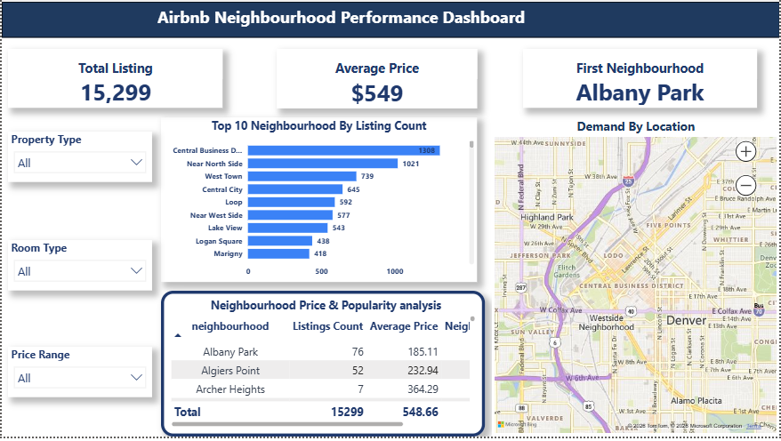
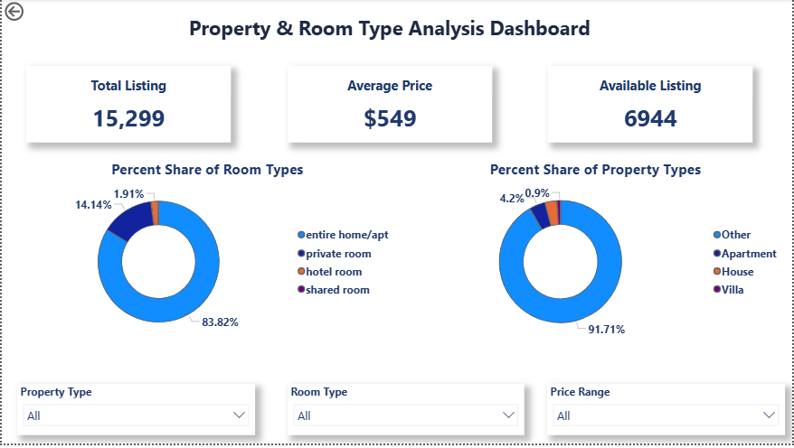
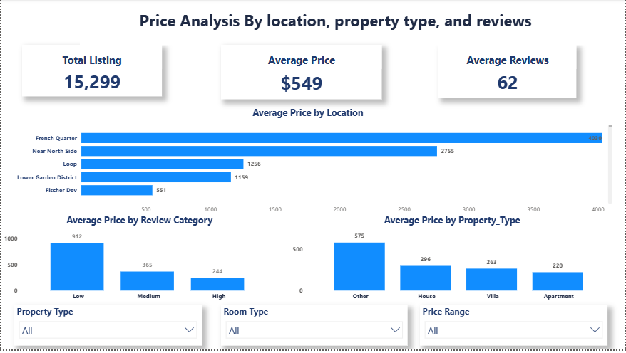
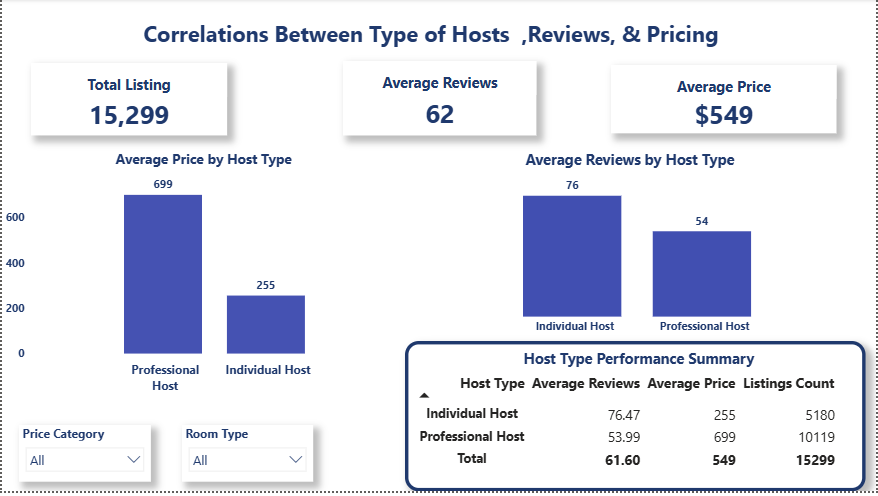

# Airbnb Listings Dashboard

A Power BI portfolio project exploring listing prices, room types, neighbourhoods, reviews, and availability.

## Public-safe dataset

This public repository includes an anonymized workbook with 16,107 rows and 11 retained fields: `neighbourhood_group`, `neighbourhood`, `room_type`, `price`, `minimum_nights`, `number_of_reviews`, `last_review`, `reviews_per_month`, `calculated_host_listings_count`, `availability_365`, and `number_of_reviews_ltm`. Listing and host names/IDs, exact coordinates, and license values were removed; review dates were reduced to month precision.

Dataset: [`Airbnb_Listings_Anonymized.xlsx`](Airbnb_Listings_Anonymized.xlsx).

## Dashboard file

The original PBIX can embed the unredacted source data. It is not included in this public repository until a sanitized report has been saved and checked in Power BI Desktop.

## Requirements

- Power BI Desktop
- Use the anonymized workbook above when reconnecting or rebuilding the report

## Dashboard previews

### Overview

### Property and room type

### Price and location

### Host and review analysis

